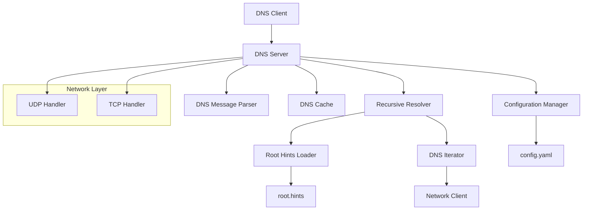

# Design Document: Recursive DNS Server

## Overview

The recursive DNS server will be implemented in Python as a multi-threaded application that handles DNS queries on both UDP and TCP protocols. The server performs full recursive resolution by starting with root servers and following referrals down the DNS hierarchy until reaching authoritative answers.

The architecture follows a modular design with clear separation between network handling, DNS message processing, recursive resolution logic, and configuration management. This ensures maintainability and allows for easy testing of individual components.

## Architecture



## Components and Interfaces

### DNS Server Core
The main server component that coordinates all operations:

```python
class DNSServer:
    def __init__(self, config_path: str, hints_path: str)
    def start(self) -> None
    def stop(self) -> None
    def handle_query(self, query: DNSMessage, client_addr: tuple) -> DNSMessage
```

### DNS Message Parser
Handles parsing and serialization of DNS messages:

```python
class DNSMessageParser:
    def parse_query(self, data: bytes) -> DNSMessage
    def serialize_response(self, response: DNSMessage) -> bytes
    def validate_message(self, message: DNSMessage) -> bool
```

### Recursive Resolver
Implements the core recursive resolution logic:

```python
class RecursiveResolver:
    def __init__(self, root_hints: List[str], cache: DNSCache)
    def resolve(self, query: DNSQuery) -> DNSResponse
    def iterate_query(self, query: DNSQuery, nameservers: List[str]) -> DNSResponse
```

### DNS Cache
Provides caching functionality with TTL support:

```python
class DNSCache:
    def get(self, key: str) -> Optional[DNSRecord]
    def put(self, key: str, record: DNSRecord, ttl: int) -> None
    def cleanup_expired(self) -> None
```

### Configuration Manager
Handles loading and validation of configuration files:

```python
class ConfigManager:
    def load_config(self, path: str) -> DNSConfig
    def load_root_hints(self, path: str) -> List[str]
    def validate_config(self, config: DNSConfig) -> bool
```

### Network Handlers
Separate handlers for UDP and TCP protocols:

```python
class UDPHandler:
    def start_server(self, port: int) -> None
    def handle_request(self, data: bytes, addr: tuple) -> None

class TCPHandler:
    def start_server(self, port: int) -> None
    def handle_connection(self, conn: socket.socket) -> None
```

## Data Models

### DNS Message Structure
```python
@dataclass
class DNSHeader:
    id: int
    flags: int
    qdcount: int
    ancount: int
    nscount: int
    arcount: int

@dataclass
class DNSQuestion:
    name: str
    qtype: int
    qclass: int

@dataclass
class DNSRecord:
    name: str
    rtype: int
    rclass: int
    ttl: int
    data: bytes

@dataclass
class DNSMessage:
    header: DNSHeader
    questions: List[DNSQuestion]
    answers: List[DNSRecord]
    authority: List[DNSRecord]
    additional: List[DNSRecord]
```

### Configuration Structure
```python
@dataclass
class DNSConfig:
    listen_port: int = 53
    listen_address: str = "0.0.0.0"
    timeout: int = 5
    max_retries: int = 3
    cache_size: int = 1000
    cache_ttl: int = 3600
    log_level: str = "INFO"
```

## Correctness Properties

*A property is a characteristic or behavior that should hold true across all valid executions of a system-essentially, a formal statement about what the system should do. Properties serve as the bridge between human-readable specifications and machine-verifiable correctness guarantees.*

### Property Reflection

After reviewing all properties identified in the prework, I can consolidate some redundant properties:

- Properties 1.1 and 1.2 (UDP/TCP query handling) can be combined into a single protocol-agnostic property
- Properties 5.1 and 5.2 (UDP/TCP listening) are specific examples that don't need separate properties
- Properties 3.1 and 3.4 (root hints file reading and format support) can be combined into a round-trip property
- Properties 4.1 and 4.4 (config file reading and option support) can be combined
- Properties 6.3 and 6.4 (error and success logging) can be combined into a general logging property

### Converting EARS to Properties

Based on the prework analysis, here are the key correctness properties:

**Property 1: DNS Query Processing**
*For any* valid DNS query sent to the server on either UDP or TCP, the server should accept the query and return a properly formatted DNS response
**Validates: Requirements 1.1, 1.2, 1.3**

**Property 2: Error Response Generation**
*For any* invalid or malformed DNS query, the server should return an appropriate DNS error response with the correct error code
**Validates: Requirements 1.4, 6.1**

**Property 3: Recursive Resolution Initiation**
*For any* DNS query not found in cache, the server should initiate recursive resolution by first querying the root servers specified in the root hints file
**Validates: Requirements 2.1, 3.2**

**Property 4: DNS Hierarchy Traversal**
*For any* DNS query requiring recursion, the server should follow referrals through each level of the DNS hierarchy until reaching an authoritative answer
**Validates: Requirements 2.2, 2.3, 2.4**

**Property 5: Root Hints Configuration Round-trip**
*For any* valid root hints file in standard format, loading then using the hints for queries should produce the expected root server contacts
**Validates: Requirements 3.1, 3.4**

**Property 6: Configuration Error Handling**
*For any* missing or invalid configuration file (config or root hints), the server should fail to start with appropriate error messages
**Validates: Requirements 3.3, 4.3**

**Property 7: Configuration Application**
*For any* valid configuration file with specified settings, the server should apply those settings (ports, timeouts, cache size) to its operation
**Validates: Requirements 4.2, 4.4**

**Property 8: UDP Size Limit Handling**
*For any* DNS query that would generate a response exceeding UDP size limits, the server should set the truncation bit and support TCP fallback
**Validates: Requirements 5.3, 5.4**

**Property 9: Concurrent Request Handling**
*For any* set of simultaneous DNS queries on both UDP and TCP, the server should handle all requests concurrently without blocking
**Validates: Requirements 5.5**

**Property 10: Error Resilience**
*For any* network error during DNS resolution, the server should log the error and continue serving other requests without interruption
**Validates: Requirements 6.2**

**Property 11: Operation Logging**
*For any* DNS server operation (successful queries, errors, configuration issues), appropriate log messages should be generated with sufficient detail for monitoring
**Validates: Requirements 6.3, 6.4**

## Error Handling

The server implements comprehensive error handling at multiple levels:

### Network Level Errors
- Socket binding failures (port already in use, permission denied)
- Connection timeouts and network unreachable errors
- Malformed packet reception

### DNS Protocol Errors
- Invalid message format (truncated, malformed headers)
- Unsupported query types or classes
- Recursive resolution failures (NXDOMAIN, SERVFAIL)

### Configuration Errors
- Missing or unreadable configuration files
- Invalid configuration values (negative timeouts, invalid ports)
- Malformed root hints file

### Runtime Errors
- Cache overflow conditions
- Thread pool exhaustion
- Memory allocation failures

All errors are logged with appropriate severity levels and include sufficient context for debugging. The server maintains operation whenever possible, only terminating on critical configuration or binding failures.

## Testing Strategy

The testing approach combines unit tests for individual components with property-based tests for system-wide correctness guarantees.

### Unit Testing
Unit tests focus on specific examples and edge cases:
- DNS message parsing with various record types
- Configuration file loading with different formats
- Cache operations with TTL expiration
- Network handler setup and teardown
- Error condition handling

### Property-Based Testing
Property-based tests verify universal properties using the **Hypothesis** library for Python:
- Each property test runs a minimum of 100 iterations
- Tests generate random DNS queries, configurations, and network conditions
- Properties validate the universal correctness guarantees identified in the design

**Property Test Configuration:**
- Library: Hypothesis (Python property-based testing framework)
- Minimum iterations: 100 per property test
- Test tagging format: **Feature: recursive-dns-server, Property {number}: {property_text}**

**Test Organization:**
- Unit tests: Validate specific examples, edge cases, and error conditions
- Property tests: Validate universal properties across all valid inputs
- Integration tests: Verify end-to-end DNS resolution flows
- Performance tests: Ensure acceptable response times under load

The dual testing approach ensures both concrete correctness (unit tests) and universal correctness (property tests), providing comprehensive validation of the DNS server implementation.